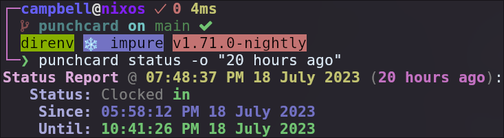

# punchcard

A simple program to keep track of working hours.


<small>Colors are customizable through arguments on the `report` command. Installing completions is highly recommended to customize the table as there are a lot of options.</small>

## Installation

**By default, punchcard requires nightly to support SIMD. Must be compiled using the nightly version defined in [the toolchain file](./rust-toolchain.toml).**

```shell
# on stable Rust
cargo install punchcard --no-default-features --features stable

# on nightly Rust
cargo install punchcard
```

If you are using stable Rust, compile with `--no-default-features --features stable`. The MSRV for stable builds is `1.71.1`. There is no MSRV policy because this program mainly targets nightly, so the MSRV can change at any time.

#### Completions

Print the completions file with `punchcard completions <your shell>` and pipe it to the appropriate folder for your shell.

### Development/Debug builds

```shell
cargo run --no-default-features --features debug -- <args>
# or use the helper script which does exactly this:
./dev.sh -- <args>
```

## Usage

```
$ punchcard --help
A CLI tool for tracking work-from-home hours.

Usage: punchcard [OPTIONS] <COMMAND>

Commands:
  in             Clock in
  out            Clock out
  toggle         Clock either in or out
  status         Check the current status
  report         Interpret the times and generate a report
  completions    Generate completions for the given shell
  generate-data  Generate test data
  help           Print this message or the help of the given subcommand(s)

Options:
  -d, --data-folder <DATA_FOLDER>  [env: PUNCHCARD_DATA_FOLDER=.] [default: /home/campbell/.local/share/punchcard]
  -t, --timezone <TIMEZONE>        [env: PUNCHCARD_TIMEZONE=] [default: America/Los_Angeles]
  -h, --help                       Print help
  -V, --version                    Print version
```

**NOTE: The `generate-data` subcommand is only available with the feature flag `generate_test_data`.**
<br />
This flag is enabled by the `debug` feature flag, but can be enabled in release builds as well.

When using the `in`, `out`, `toggle`, and `status` subcommands, the `-o` option can be used to specify an offset from the current time.

Some examples of valid inputs:

- "in 1h 30m" -> add 1h 30m to the current time
- "1h 30m" -> add 1h 30m to the current time
- "1h 30m ago" -> subtract 1h 30m from the current time

The `in` prefix is optional; by default, the offset is added to the current time.

The offset is parsed by the `humantime` crate. It accepts a variety of formats. The suffixes do not have to be single letters, but they must be separated by whitespace. For example, you may use `1hours`, `1hour`, `1hr`, or `1h` to specify 1 hour.

For a list of all the suffixes, see the documentation for the `humantime` crate:

https://docs.rs/humantime/latest/humantime/fn.parse_duration.html

## Screenshots

### Clocking In / Out


### Status Checking



### Reports

#### Using the above clock entries

##### Weekly (default)


##### Daily


#### Using generated test data

##### Weekly (default)


##### Daily


